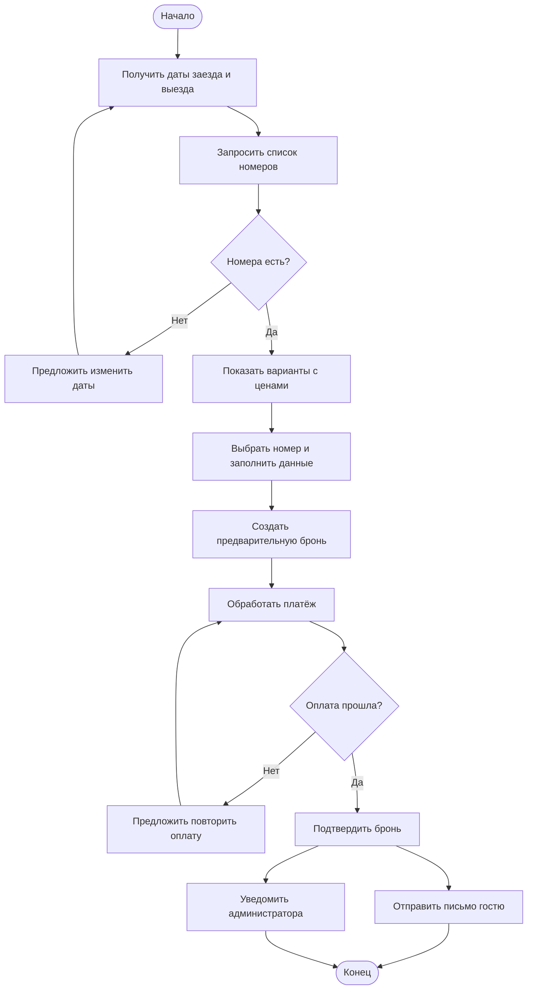

# Flowchart — Проверка доступности номера и оплата

Блок-схема алгоритма проверки доступности номера и обработки оплаты.

```mermaid
flowchart TD
    A([Начало]) --> B[Получить даты заезда и выезда]
    B --> C[Запросить список номеров]
    C --> D{Номера есть?}

    D -- Нет --> E[Предложить изменить даты]
    E --> B

    D -- Да --> F[Показать варианты с ценами]
    F --> G[Выбрать номер и заполнить данные]
    G --> H[Создать предварительную бронь]
    H --> I[Обработать платёж]
    I --> J{Оплата прошла?}

    J -- Нет --> K[Предложить повторить оплату]
    K --> I

    J -- Да --> L[Подтвердить бронь]
    L --> M[Отправить письмо гостю]
    L --> N[Уведомить администратора]
    M --> O([Конец])
    N --> O
```