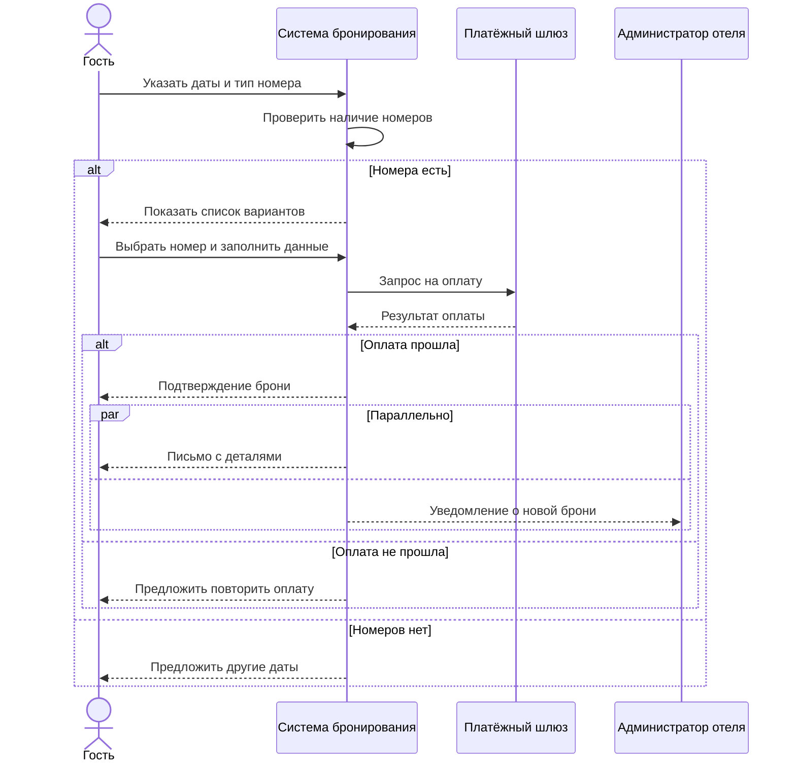

```mermaid
sequenceDiagram
    actor Гость
    participant Система as Система бронирования
    participant ПлатёжныйШлюз as Платёжный шлюз
    participant Админ as Администратор отеля

    Гость->>Система: Указать даты и тип номера
    Система->>Система: Проверить наличие номеров

    alt Номера есть
        Система-->>Гость: Показать список вариантов
        Гость->>Система: Выбрать номер и заполнить данные
        Система->>ПлатёжныйШлюз: Запрос на оплату
        ПлатёжныйШлюз-->>Система: Результат оплаты

        alt Оплата прошла
            Система-->>Гость: Подтверждение брони
            par Параллельно
                Система-->>Гость: Письмо с деталями
            and
                Система-->>Админ: Уведомление о новой брони
            end
        else Оплата не прошла
            Система-->>Гость: Предложить повторить оплату
        end
    else Номеров нет
        Система-->>Гость: Предложить другие даты
    end
```