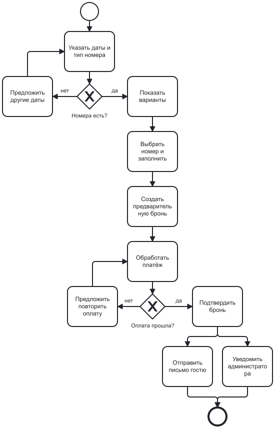
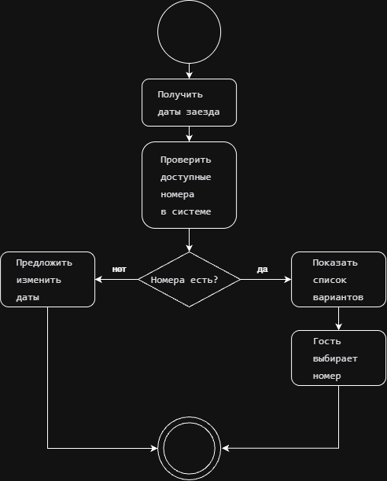

# Отчёт по лабораторной работе №1

## Тема процесса
Бронирование номера в отеле.

Описание процесса
Гость указывает даты заезда и выезда, количество гостей и тип номера. Система бронирования проверяет наличие свободных номеров на выбранные даты. Если номера есть — гость выбирает подходящий вариант, заполняет персональные данные и переходит к оплате. Платёжный шлюз обрабатывает платёж. При успешной оплате система подтверждает бронь и параллельно отправляет письмо гостю и уведомляет администратора отеля. Если номеров нет — система предлагает изменить даты. Если оплата не прошла — предлагает повторить платёж, бронь сохраняется на 15 минут.

Диаграммы

BPMN

UML Activity

Sequence Diagram (Mermaid)
[docs/sequence.md](docs/sequence.md)

Flowchart (Mermaid)
[docs/flowchart.md](docs/flowchart.md)

Выводы
Научилась настраивать Git-репозиторий, освоила базовые команды и работу
с графическими нотациями (BPMN, UML Activity, Sequence, Flowchart),
научилась сохранять все артефакты в репозитории и на практике увидела разницу между
текстовыми и бинарными форматами при версионировании.
